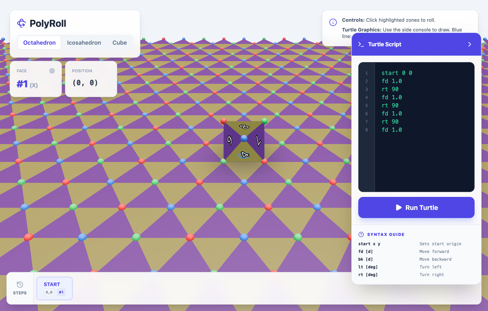

# PolyRoll

A 3D interactive simulation of polyhedra rolling on geometric surfaces. Roll various polyhedra (including degenerate forms) across triangular, square, or hexagonal grids, visualize turtle graphics paths, and explore the mathematics of polyhedral geometry.

**🌐 [Live Demo](https://slef.github.io/PolyRoll/)**

<div align="center">
  
</div>

## Features

- **Multiple Polyhedra**: Switch between octahedron, cube, icosahedron, tetrahedron, and doubly covered polygons
- **Interactive Rolling**: Click highlighted zones to roll the polyhedron along edges
- **Turtle Graphics**: Draw paths on the polyhedron surface using turtle commands
- **Real-time Tracking**: Monitor current face, position coordinates, and orientation
- **Move History**: Navigate through a history of all moves with step-by-step playback
- **3D Visualization**: Beautiful 3D rendering with shadows, lighting, and camera controls

## Controls

- **Mouse**: Click highlighted zones around the polyhedron to roll it
- **Orbit Controls**: Click and drag to rotate the camera, scroll to zoom
- **Shape Selection**: Use the buttons in the top-left to switch between polyhedra
- **Turtle Console**: Use the side panel to write turtle graphics commands

## Turtle Graphics Syntax

- `start x y` - Sets the starting origin
- `fd [distance]` - Move forward
- `bk [distance]` - Move backward
- `lt [degrees]` - Turn left
- `rt [degrees]` - Turn right

## Run Locally

**Prerequisites:** Node.js (v20.19.0+ or v22.12.0+)

1. Install dependencies:
   ```bash
   npm install
   ```

2. Run the development server:
   ```bash
   npm run dev
   ```

3. Open your browser to `http://localhost:3000`

## Build for Production

```bash
npm run build
```

The built files will be in the `dist` directory.

## Tech Stack

- **React** - UI framework
- **Three.js** - 3D graphics
- **React Three Fiber** - React renderer for Three.js
- **React Three Drei** - Useful helpers for R3F
- **Vite** - Build tool and dev server
- **TypeScript** - Type safety
- **Tailwind CSS** - Styling
